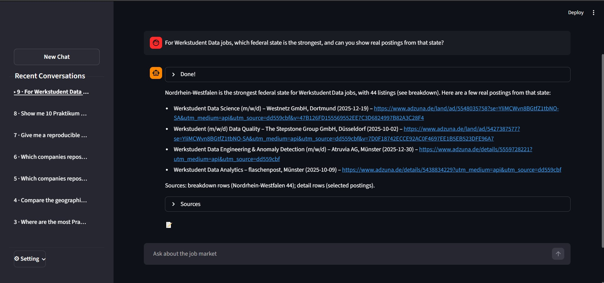
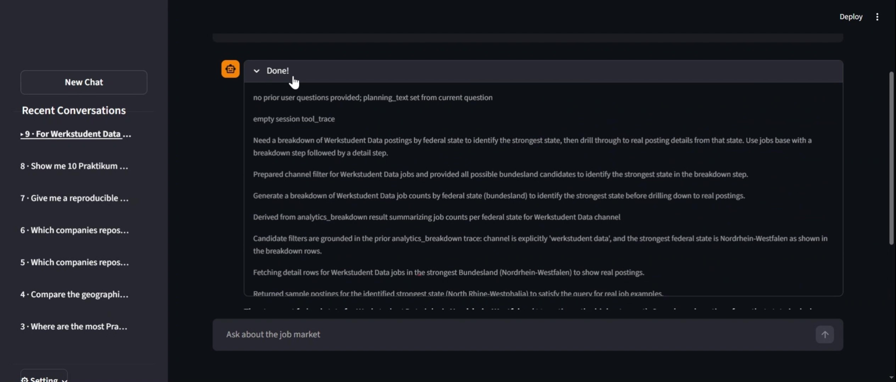
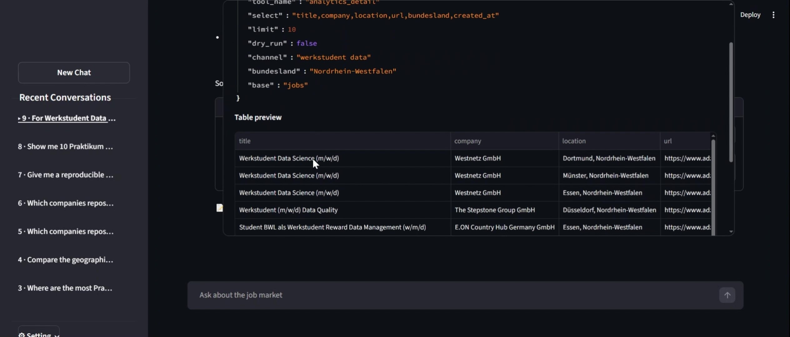
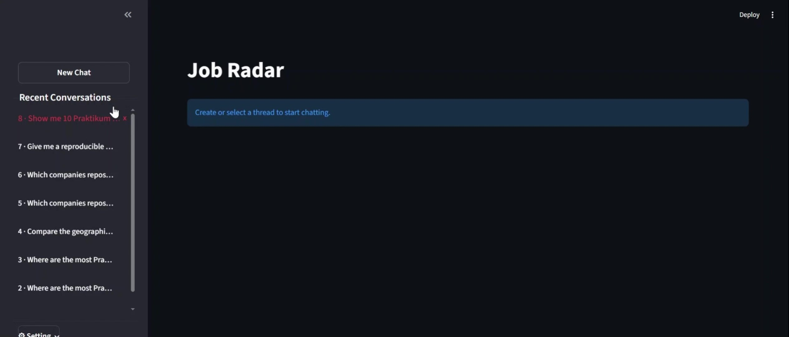
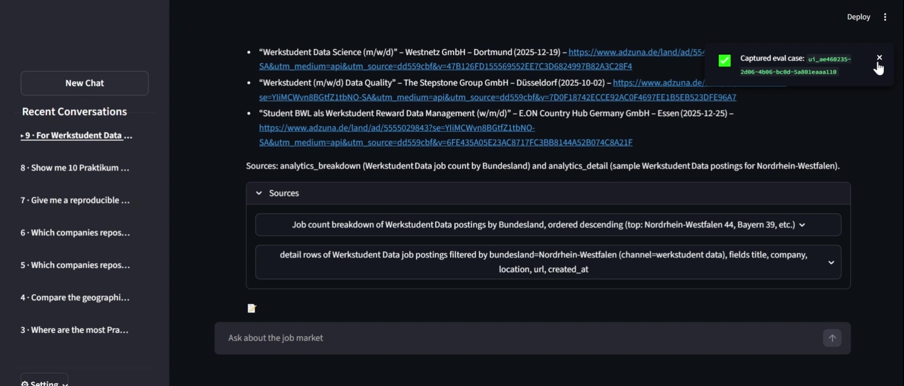
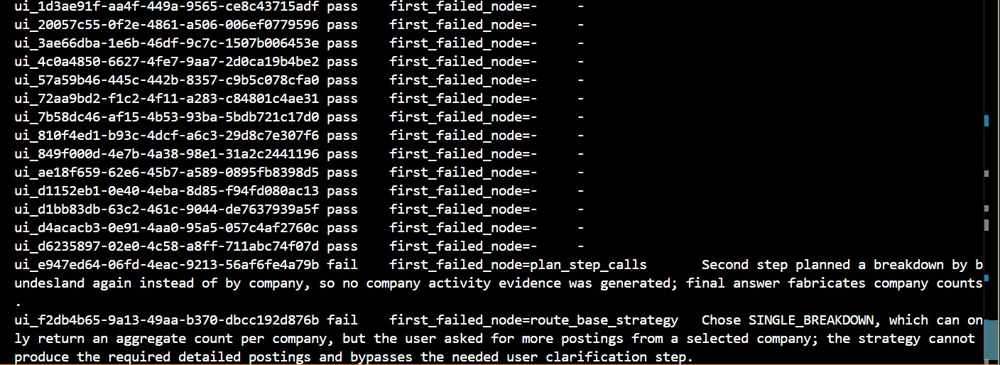

# Job Market Radar

**A governed analytics chatbot agent for the German entry-level data/AI job market**

Job Market Radar is an end-to-end analytics application that helps users explore the German entry-level data/AI job market through a chatbot interface. It provides scripts for collecting job data and building a local analytics-ready database, governed analytics tools on top of that data, and a chatbot agent that can use those tools to answer user questions. Instead of relying on unconstrained text generation, the system is built around controlled data access, structured agent behavior, and evidence-backed responses. This ensures that every insight provided is fully inspectable and trustworthy.

Alongside the user-facing application, this project also includes an evaluation pipeline that captures real-world interactions and transforms them into replayable test cases evaluated by an LLM-as-a-judge. This enables deep inspection of the agent's internal workflow, helping to identify bottlenecks in specific nodes and supporting systematic performance tracking when prompts, logic, or underlying models are updated.

The project is designed to demonstrate a product-shaped architecture that combines data handling, governed analytics access, workflow-based agent orchestration, and practical evaluation for agent quality control.

## Product walkthrough

Job Market Radar is designed as an interactive analytics chatbot application with built-in support for agent inspection and evaluation. Users can ask questions about the German entry-level data/AI job market through the chat interface and receive answers grounded in controlled analytics logic rather than unconstrained model responses.



The application makes the agent process visible. Instead of hiding the reasoning workflow behind a single answer, the system allows users to inspect how a question was processed, which is useful both for trust and for debugging agent behavior.

[](docs/videos/agent_trace.mp4)

Answers can also be inspected together with the underlying evidence. The interface exposes the parameters and results of the governed queries used by the agent, making it possible to see what data supported a response instead of treating the chatbot as a black box.

[](docs/videos/evidence_view.mp4)

The application supports multiple independent conversation threads, which makes it easier to explore different questions or scenarios without collapsing everything into one running chat history. 

[](docs/videos/conversation_threads.mp4)

The interface also supports capturing user turns as evaluation cases, so real interactions can later be replayed and analyzed as part of the evaluation workflow.

[](docs/videos/capture_eval_case.mp4)

Besides the interactive app, the project includes a separate regression evaluation workflow. Captured user turns can be replayed through the agent and reviewed with an LLM judge to identify which workflow steps behaved unexpectedly, making it easier to monitor agent quality and assess changes in prompts, logic, or models.



## Architecture

The project has two connected flows: a user-facing application flow and a separate evaluation flow. In the main application flow, job data is pulled on demand through scripts and prepared into an analytics-ready layer. The FastAPI service exposes governed analytics endpoints on top of that data. The LangGraph agent uses those endpoints to answer user questions, and the results are presented through the Streamlit app. In the evaluation flow, selected user turns can be captured from the Streamlit app and stored as eval cases. These cases are replayed through the same agent workflow outside the UI. An LLM-based judge then reviews the replayed runs to highlight workflow steps that may need improvement.At a higher level, they can be described as follows.

**Application flow:**  
**On-demand data collection & analytics-ready preparation → FastAPI analytics service → LangGraph agent workflow → Streamlit app**

**Evaluation flow:**  
**Evaluation case capture → Agent workflow replay → LLM-based judging**

### Data collection and preparation layer

The first layer provides a robust data foundation that remains fully decoupled from the rest of the system's execution logic by fetching raw data, building raw indexes, extracting and normalizing records, loading prepared data into **DuckDB** and exporting derived analytical outputs. 

The pipeline follows a Medallion Architecture:

- **Bronze** stores raw collected job data.
- **Silver** contains cleaned and normalized job records used as the main prepared dataset.
- **Gold** contains derived analytical outputs and query-ready artifacts used for downstream analysis.
 
Instead of trying to automate refreshes on a schedule, the project uses scripts that can be run when data needs to be updated. This keeps data acquisition practical and avoids unnecessary operational complexity around timeouts, quotas, or refreshes that may not be needed.

### Analytics service layer

The second layer is a **FastAPI service** that provides governed analytics access on top of the prepared data. Rather than letting the chatbot freely invent arbitrary data access patterns, the service exposes controlled endpoints that execute **pre-defined SQL logic** with explicit parameters and structured outputs.

The core analytics interface is built around reusable primitives:

- **breakdown** executes grouped queries to provide analytical views (e.g., aggregations by dimension).
- **detail** performs row-level inspection to retrieve specific records.
- **sample** returns deterministic representative examples via parameterized sampling.

To prevent the agent from making assumptions about the data, without having to hard-code business logic, the service provides a governance and metadata framework:

- **semantic spec** defines exactly which metrics, dimensions, and filters are valid for SQL construction.
- **filter values** provides a source of truth for valid field entries, preventing query errors.
- **definitions** acts as a system glossary to map business concepts to their underlying database implementations.

### Agent layer

The third layer is a **LangGraph-based chatbot agent** implemented as an explicit stateful execution graph. Rather than treating question-answering as a single prompt, the agent processes each turn through a sequence of controlled nodes, executing multiple reasoning steps before finalizing a response. The underlying LLM is powered by **Ollama**, enabling flexible swapping between different model backends without changing the agent workflow or tool layer. The workflow leverages **LangGraph checkpoints** to persist state for seamless reconstruction. Integrated with **LangSmith tracing**, this setup streamlines real-time monitoring during evaluation.

At a high level, a turn flows through these stages:

- **start turn** acts as the entry point to initialize the agent's state. It captures the new question while resolving context from previous interactions, ensuring the agent understands the user intent (e.g., references like 'this company' or 'that job').
- **select relevant memory** identifies relevant prior query results to be reused in the current turn. This avoids redundant tool execution and improves efficiency by leveraging existing evidence.
- **route base and strategy** determines the analytical approach by choosing the analytical base (e.g., individual job postings vs. aggregated roles) and the execution strategy that best matches the question.
- **initialize execution state** converts the chosen route into an execution state that the graph can iterate on step by step.
- **build filter-value pools** bridges the gap between user terminology and actual database entries. By preparing these validated candidate values, it ensures the agent's plans are grounded in both existing data and the current context, effectively preventing invalid queries or empty results.
- **plan tool calls** proposes parameters for the tool calls to the analytics service endpoints. For the current step of the chosen strategy, it populates the pre-defined SQL logic based on validated entries from the filter-value pools.
- **finalize step calls** validates and repairs the planned parameters to ensure safe and compliant execution against the service endpoints.
- **execute calls** performs the validated tool calls by sending requests to the service endpoints. This triggers the underlying queries within the analytics layer and retrieves the specific results needed for the current step.
- **commit step results** interprets and persists execution outputs into session memory to be reused as evidence for both current and future questions.
- **decide next step** decides whether to trigger another execution cycle or produce the final response based on the completion of all steps within the chosen strategy.

### Application layer

The fourth layer is a **Streamlit application** that serves as the primary user-facing interface. It provides a structured environment where users can monitor the agent's logic through individual nodes and inspect specific query results to verify the agent's responses. Additionally, the app allows users to capture real-world interactions to serve as test cases for regression evaluation.

Thanks to LangGraph checkpoints, the application can instantly reconstruct any conversation state, ensuring users can resume their work exactly where they left off, even after a restart. Behind the UI, the app utilizes a dedicated database to manage multiple conversation threads in an organized and distinct manner. This setup ensures that conversation data, LangGraph checkpoints, and LangSmith tracing are kept fully synchronized, maintaining a unified record of the agent's logic and state across the entire development lifecycle

### Evaluation workflow

The evaluation workflow is built around three stages. First, real user turns are captured from the Streamlit application and stored as evaluation cases. Second, these cases are replayed through the agent so that the full execution process can be recorded. Finally, the recorded process is reviewed at scale with an LLM-as-a-judge to identify where the workflow is likely behaving unexpectedly.

This approach is driven by two strategic decisions:

- **Real-world test cases**: Mirroring actual user turns preserves the ambiguity, variation, and edge cases that appear in normal usage and are hard to reproduce manually.

- **LLM-as-a-judge**: Large numbers of replayed cases cannot be reviewed efficiently by hand. An LLM is therefore used to surface the highest-priority failure points, so human inspection can focus on the most critical issues before more detailed refinements are made.

## Getting started

### Clone and set up the environment

    ```bash
    git clone <YOUR_GITHUB_REPO_URL> job-market-radar
    cd job-market-radar

    python -m venv .venv
    source .venv/Scripts/activate   # Git Bash on Windows
    python -m pip install --upgrade pip
    pip install -r requirements.txt
    cp .env.example .env
    ```

### Prepare local data

The project needs a local job-posting dataset for the analytics service and chatbot agent. For demonstration, it is built around data collected from the free Adzuna API, but you can also use your own data if it matches the expected downstream structure.

If you want to use Adzuna data, create a free Adzuna developer account, get an application ID and key, and set them in your local `.env` file:
    ```env
    ADZUNA_APP_ID=your_app_id_here
    ADZUNA_APP_KEY=your_app_key_here
    ADZUNA_COUNTRY=de
    ```

1. **Bronze: raw data acquisition**
The bronze stage stores raw request and response files exactly as fetched from the source. Because Adzuna allows at most `results_per_page=50`, larger collections require multiple page requests. For example, to collect about 100 `praktikum data`, 50 `junior data`, and 80 `werkstudent data` postings:
    ```bash
    python src/pipeline/fetch_adzuna_jobs_search.py --what "praktikum data" --page 1 --results_per_page 50
    python src/pipeline/fetch_adzuna_jobs_search.py --what "praktikum data" --page 2 --results_per_page 50
    python src/pipeline/fetch_adzuna_jobs_search.py --what "junior data" --page 1 --results_per_page 50
    python src/pipeline/fetch_adzuna_jobs_search.py --what "werkstudent data" --page 1 --results_per_page 50
    python src/pipeline/fetch_adzuna_jobs_search.py --what "werkstudent data" --page 2 --results_per_page 30
    ```
Each run writes a raw request file and a raw response file under the raw data directory, grouped by download date. You can also remove older raw snapshots to keep the local raw-data folder focused on recent collections. For example, to preview which raw folders would be removed before `2026-01-01`:
    ```bash
    python src/pipeline/delete_raw_by_date.py --before 2026-01-01
    ```

2. **Silver: indexing and extracting a processed dataset**
The silver stage organizes the raw files and converts them into a cleaned, standardized dataset. First, run `build_raw_index_adzuna.py` to update the raw-file index after new data has been collected. Then run `extract_adzuna.py` to extract and combine the selected query results into one processed table. For example:
    ```bash
    python src/pipeline/build_raw_index_adzuna.py
    python src/pipeline/extract_adzuna.py --dataset entry_level_v1 \
    --what "praktikum data" \
    --what "junior data" \
    --what "werkstudent data" \
    --mode overwrite
    ```
This produces a processed dataset such as data/processed/entry_level_v1.csv. You can use `--mode overwrite` to rebuild the dataset from the selected raw inputs, or `--mode append` to add newly collected raw files to an existing processed dataset.

3. **Gold: load the active dataset for serving**
The gold stage loads a processed dataset into DuckDB as the active warehouse table and applies the semantic SQL views used by the API and agent.
    ```bash
    python src/pipeline/load_to_duckdb.py --dataset entry_level_v1
    ```
After this step, the local warehouse is ready for the FastAPI service, the chatbot agent, and the evaluation workflow.

### Run the API

Start the FastAPI service. Keep it running while using the chatbot agent or the evaluation workflow, since both depend on the API for governed analytics access.
    ```bash
    python -m uvicorn src.api.main:app --reload
    ```

You can optionally open the following endpoints to verify that the service started correctly:
- http://127.0.0.1:8000/health
- http://127.0.0.1:8000/docs

### Run the app

With the FastAPI service still running, start the Streamlit application in a separate terminal:
    ```bash
    python -m streamlit run src/app/ui/streamlit_app.py
    ```
The interface should open automatically in your browser. If it does not, open the local Streamlit URL shown in the terminal manually.

### Run evaluation replay and judging

If you want to evaluate the agent, capture important turns from real usage, especially cases that should be preserved as regression tests or cases where the behavior should be improved. 

1. **Replay captured cases through the agent**
Use `run_cases` to replay stored eval cases and generate fresh execution results:
   ```bash
   python -m src.eval.run_cases
   ```
After replay, the resulting cases are marked as unjudged until the judge step is run. You can also narrow the replay scope with `--new-only` to replay only cases that do not yet have an eval result, or `--failed-only` to replay only cases whose latest result failed or errored. 

2. **Judge replayed results**
Use `run_eval` to review replayed results with the LLM-based evaluator:
   ```bash
   python -m src.eval.run_eval
   ```
Other options include `--unjudged-only` to judge only results that have not yet been judged, or `--failed-llm-judge-only` to retry only results whose previous judging step failed because of the LLM judge.

3. **Inspect and manage cases and results**
Use `src.eval.cli` to inspect stored cases and results, review one case in detail, or delete cases when needed:
   ```bash
   python -m src.eval.cli cases
   python -m src.eval.cli results
   python -m src.eval.cli result <case_id>
   python -m src.eval.cli delete-case <case_id>
   ```

After reviewing replay and judging results, you may decide to improve the agent. Depending on what the evaluation reveals, this can involve refining prompts, adjusting workflow logic, changing node behavior, or switching the underlying model. The same captured cases can then be replayed and judged again, making the evaluation pipeline a practical loop for iterative improvement rather than a one-time inspection step.

### Notes
1. **Project configuration (`configs/assistant.yaml`)**
  - `ollama.model`: Model name passed to Ollama (swap the LLM behind the agent by changing this).
  - `ollama.timeout_sec`: Timeout for a single LLM call.
  - `agent.request_timeout_sec`: Timeout for each API/tool call.
  - `agent.max_repairs`: Max retries when the model produces invalid tool arguments.
  - `agent.max_rows_to_llm`: Max number of result rows included in the prompt.
  - `agent.max_chars_to_llm`: Max total characters included from tool outputs (hard truncation).

2. **LangSmith tracing setup**
If you want traces in LangSmith, first create/get an API key from your LangSmith account, then set these environment variables in a local `.env` file:
    ```env
    LANGCHAIN_API_KEY=your_langsmith_api_key
    LANGSMITH_TRACING=true
    LANGSMITH_PROJECT=job-market-radar
    ```